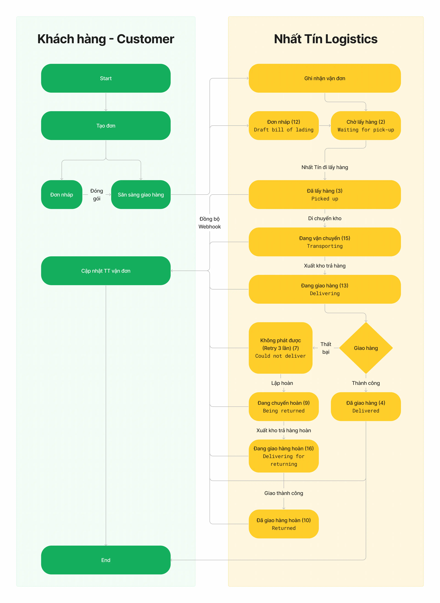

# Thông tin kết nối

## Thông báo quan trọng!!!

- Hệ thống Nhất Tín sẽ đồng bộ với Hệ thống địa danh mới của Nhà nước. Chi tiết như sau: 1.Yêu cầu Khách hàng cần mapping theo mã địa danh của Nhà nước khi truyền qua Nhất Tín.

1. Từ 08/07/2025 đến 20/07/2025 Khách hàng API có thể UAT ở môi trường sandbox.

2. Từ 24/07/2025 sẽ go-live trên môi trường production. API địa danh mới ở mục /location. Khách hàng có thể tham khảo và mapping.

# Môi trường

Nhất Tín cung cấp hai môi trường riêng biệt cho việc tích hợp:

**Sandbox:** Sử dụng cho việc xây dựng tính năng, kiểm thử, gỡ lỗi, v.v...
**Production:** Sử dụng cho Người dùng cuối.

# Request header

**authorization:** Bearer <access_token>  (vui lòng tham khảo phần Xác thực JWT)

# Request body

The request body dưới định dạng JSON. Data sẽ thay đổi tùy thuộc vào yêu cầu. Để biết thêm thông tin, hãy xem cụ thể về các API

# Cấu hình

| Môi trường | Host |
| --- | --- |
| Sandbox | https://apisandbox.ntlogistics.vn |
| Production | https://apiws.ntlogistics.vn |

| Môi trường | Portal Web |
| --- | --- |
| Sandbox | https://bodev.ntlogistics.vn |
| Production | https://khachhang.ntlogistics.vn |

# Dữ liệu chính

### 1. Dịch vụ (service_id)

| ID | Tên dịch vụ |
| --- | --- |
| 90 | Giao hàng nhanh (CPN) |
| 81 | Hỏa tốc |
| 91 | Tiết kiệm |
| 21 | Hỗn hợp MES |

### 2. Hình thức thanh toán (payment_method)

| ID | Hình thức thanh toán |
| --- | --- |
| 10 | Người gửi thanh toán ngay |
| 11 | Người gửi thanh toán sau |
| 20 | Người nhận thanh toán ngay |

### 3. Loại hàng hóa (cargo_type_id)

| ID | Loại hàng hóa |
| --- | --- |
| 1 | Chứng từ |
| 2 | Hàng hóa |
| 3 | Hàng lạnh |
| 4 | Sinh phẩm |
| 5 | Mẫu bệnh phẩm |

### 4. Trạng thái đơn (status_id)

| Status ID | Status Code | Mô tả |
| --- | --- | --- |
| 1 | Waiting | Chưa thành công |
| 2 | Waiting | Chờ lấy hàng |
| 3 | KCB | Đã lấy hàng |
| 4 | FBC | Đã giao hàng |
| 6 | GBV | Hủy |
| 7 | FUD | Không phát được |
| 9 | NRT | Đang chuyển hoàn |
| 10 | MRC | Đã chuyển hoàn |
| 11 | QIU | Sự cố giao hàng |
| 12 | DRF | Vận đơn nháp |
| 13 | DEL | Đang giao hàng |
| 15 |  | Đang vận chuyển |
| 16 |  | Đang giao hàng hoàn |
| 17 |  | Lỗi lấy hàng |

### 5. Qui trình trạng thái vận đơn

## Lịch sử cập nhật

| Phiên bản | Tác giả | Mô tả | Ngày cập nhật |
| --- | --- | --- | --- |
| 1.0.4 | KhoaNT | Change fulladdress from sender | 10/07/2021 |
| 1.0.5 | KhoaNT | Add calculate fee api | 23/07/2021 |
| 1.0.6 | KhoaNT | Add email receiver | 28/05/2022 |
| 1.0.7 | KhoaNT | Edit request webhook | 26/08/2022 |
| 1.0.7 | KhoaNT | Add connect to NTL | 26/08/2022 |
| 1.0.7 | KhoaNT | Add params create bill : is_return_doc | 26/08/2022 |
| 1.0.8 | KhoaNT | Add params partner_id in Print Waybill | 01/12/2022 |
| 1.0.9 | KhoaNT | Add new api for update shipping info | 02/12/2022 |
| 1.0.10 | KhoaNT | Add new params response when tracking : p_link_image | 24/02/2023 |
| 1.0.11 | KhoaNT | Add new shipping version 2 | 29/03/2023 |
| 1.0.12 | KhoaNT | Update new service list | 01/07/2023 |
| 1.0.13 | KhoaNT | Add new status (15,16) | 28/07/2023 |
| 1.0.14 | KhoaNT | Add new status (17) && Add length, width, height Fields into webhook request | 30/12/2023 |

## Danh sách API

| API List |  |
| --- | --- |
| 1. Create a Shipping v2 | 10/4/2023 sử dụng V2. |
| 2. Update Shipping |  |
| 3. Cancel Shipping |  |
| 4. Calculate Price |  |
| 5. Tracking Shipping |  |
| 6. Webhook |  |
| 7. Print waybill |  |
| 8. Login - connect to NTL | Use for ecommerce/POS platforms |
| 9. Create a Shipping By ID | Xóa api này, hổ trợ KH cũ |

>

Cập nhật vào ngày 9 tháng 7 năm 2025

Xác thực JWT

Cách đăng nhập, gọi API bằng JWT và làm mới token
